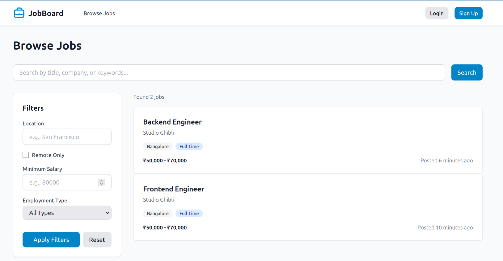
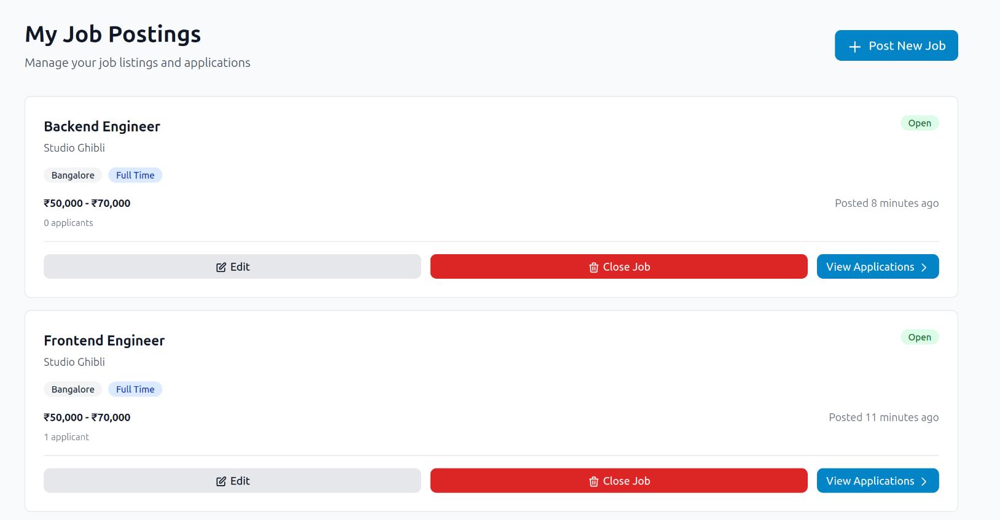
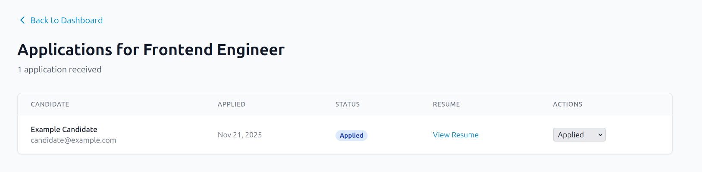
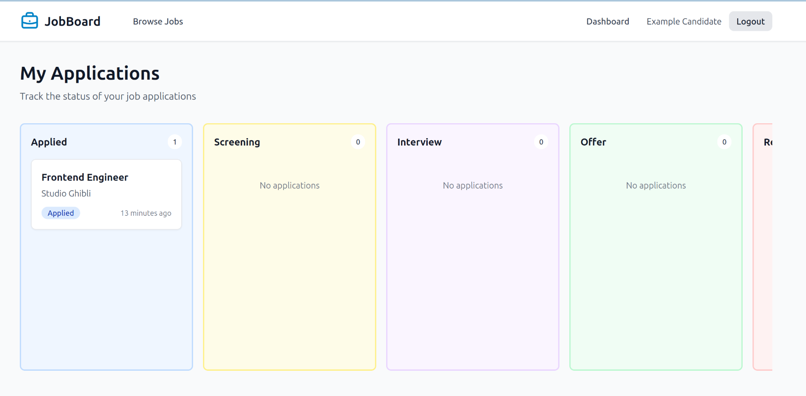

# Job Board Frontend

A fast, responsive job board built with **React 19 + TypeScript + TailwindCSS**.

Two user roles:

- **Job Seekers** – search, filter, apply, track applications (Kanban)
- **Employers** – post jobs, review applications, manage postings

## Features

- Clean & mobile-friendly UI
- Advanced job search + filters (location, salary, remote, type)
- One-click apply with resume upload
- Kanban board for application tracking
- Employer dashboard to manage jobs & candidates
- Secure login (HttpOnly cookies)
- Role-based access

## Tech Stack

- React 19
- TypeScript
- TailwindCSS
- React Router v7
- Vite
- Axios + Context API

## Screenshots

1. Browse Jobs Page 
2. My Job Postings 
3. Applications Submitted 
4. Candidate dashboard 

## Quick Start

```bash
git clone <your-repo-url>
cd job-board-frontend
npm install
cp .env.example .env
# Edit .env → set VITE_API_URL=http://localhost:5000/api
npm run dev
```

App runs at: http://localhost:5173

## Test Accounts

- **Candidate**: candidate@example.com / password123
- **Employer**: employer@example.com / password123

## Main Routes

| Path                  | Description              |
| --------------------- | ------------------------ |
| `/`                   | Home                     |
| `/jobs`               | Browse & search jobs     |
| `/jobs/:id`           | Job details + apply      |
| `/dashboard`          | Candidate: Kanban board  |
| `/employer/dashboard` | Employer: Job management |
| `/employer/jobs/new`  | Post a new job           |

## Notes

- Backend Repo: https://github.com/brijesh-0/job-board-backend
- No real-time updates (refresh to see changes)
- Resume uploads: PDF only, max 5MB
